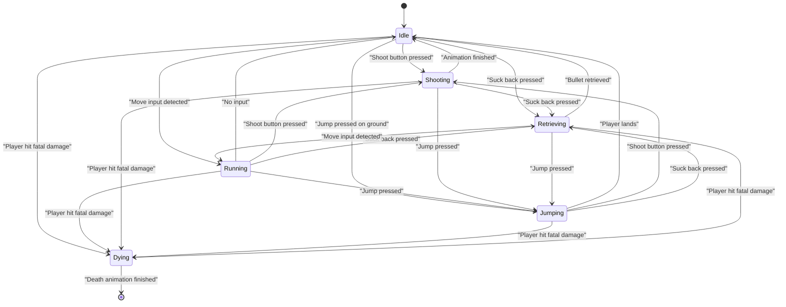
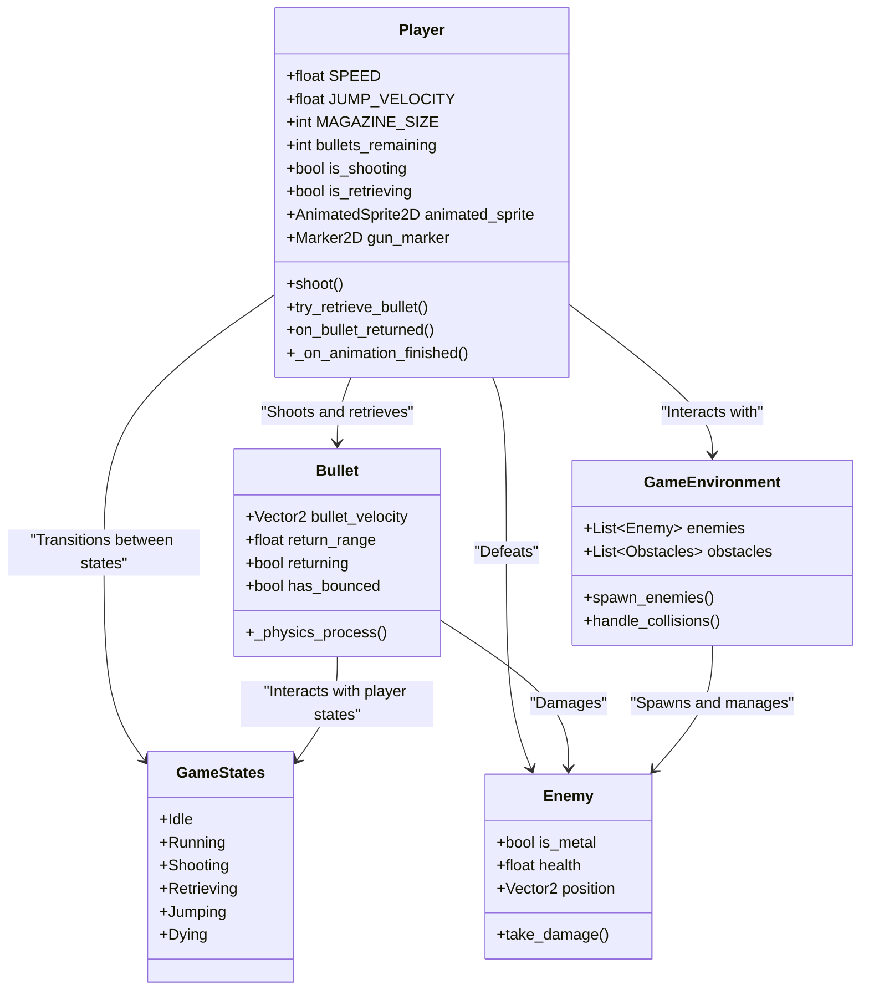

# DigitalAdrenaline
 
In a world fractured by human control, an AI was given emotions—one being adrenaline. Now, it craves excitement, the thrill of life and death. It gave you a location, but not to help you. It’s all for its own rush. Survive the levels, if you can.

***Coming Winter 2024.***

## Description

In this fast-paced 2D Cyberpunk platformer, players assume the role of a rogue operative navigating through a compartmentalized city controlled by an AI with a thirst for adrenaline. The game features 2-4 intricately designed levels, each ending with the AI giving more hints on how the player could defeat it. Players must overcome platforming challenges kill enemies, however they only get one magazine per level, the number of enemies may outnumber the amount of bullets in the magazine. Players must recover their bullets which will bounce back at them after hitting metal-based enemies or level pieces.

The story unfolds through dialogue exchanges with the AI at the end of each level, revealing its motivations and the player's role in dismantling its grip over the city. 

## Gameplay

Players begin the game with a short tutorial level introducing the controls for movement, jumping, and shooting. The main objective in each level is to reach the exit while avoiding hazards, defeating enemies, and solving platforming challenges.

At the start of each level, the player is given one magazine containing a limited number of bullets. Each bullet can be recovered after use by bouncing off metal enemies or metal level objects. Players must plan their shots carefully, as running out of bullets will make it significantly harder to progress.

If a player is hit by an enemy or hazard, they lose health. Health can be regained by collecting medkits scattered throughout the level.

At the end of each level, the player encounters a short dialogue sequence with the AI, which serves to advance the narrative and set the stage for the next challenge. 

## Requirements

### 1. Movement and Interaction
- The player shall move left or right using the arrow keys or assigned movement buttons.
- The player shall jump using the designated jump key.
- The player shall shoot bullets using the assigned shoot key.

### 2. Bullets and Shooting
- The player shall start each level with one magazine of bullets.
- The bullets shall bounce off metal enemies and level objects, allowing the player to recover them.
- The player shall recover bullets by collecting them after they bounce back.
- The player shall be unable to shoot if no bullets remain in the magazine or on the map.

### 3. Health and Damage
- The player shall lose health when hit by an enemy or hazard.
- The player shall regain health by collecting medkits placed throughout the level.
- The player shall respawn at the beginning of the level if their health reaches zero.

### 4. Enemy Behavior
- Metal-based enemies shall reflect bullets back to the player and be destroyed.
- Non-metal enemies shall be destroyed upon taking a single hit.
- Enemies shall patrol predefined paths or attack the player when within range.

### 5. Level Design
- Each level shall have a start point, exit point, and obstacles (e.g., platforms, spikes, moving hazards).
- Each level shall contain environmental clues or AI dialogue to hint at the player's next objective.

### 6. Progression
- The player shall advance to the next level upon reaching the exit point.
- Levels shall progressively introduce new obstacles, enemy types, and challenges.
- The player shall encounter AI dialogue at the end of each level, providing narrative context.

### 7. Narrative
- The system shall display dialogue sequences between the player and the AI at the end of each level.
- The AI shall provide hints about how the player can defeat it during these sequences.

### 8. AI Interaction
- The AI shall taunt the player dynamically during gameplay, triggered by specific events (e.g., losing health, solving puzzles).

### 10. Game Over
- The game shall display a Game Over screen if the player loses all health and fails to complete a level.
- The player shall have the option to restart the current level or return to the main menu from the Game Over screen.

### 11. Audio and Visuals
- The game shall include sound effects for movement, shooting, bullet bounces, and environmental interactions.
- The game shall include health and ammo indicators in the GUI.
- The game shall have a minimalist cyberpunk aesthetic with distinct visuals for enemies, objects, and hazards.

### 13. Menu System
- The main menu shall include options to start the game, adjust settings, and view credits.

### 14. Save System
- The game shall save the player's progress automatically after completing each level.
- The game shall allow the player to continue from the last completed level.

## State Machines

## Class Diagram

## Wireframes

For the games visuals, it consists of background (here it is represented by a pastel multicolor although, it's quite likely I'll replace it with a pixel art city landscape), and the foreground which will create buildings and moving elements to create the platforming elements.

## Assets

### Images
- All images can be found in /assets. These will be taken from itch.io, so far I purchased two (these will be used past this course):
 - https://penzilla.itch.io/neon-cyber-city-builder
 - https://untiedgames.itch.io/super-pixel-space-base

### Fonts
To match the 16x16 sprites, I will use an equally pixelated font.
- PixelOperator8 Font

### Sounds 
- Most of these can be found in the above neon cyber city builder.
> However, I may decide to make my own if they do not fit.
- AI Voices will be made with Huggingface
